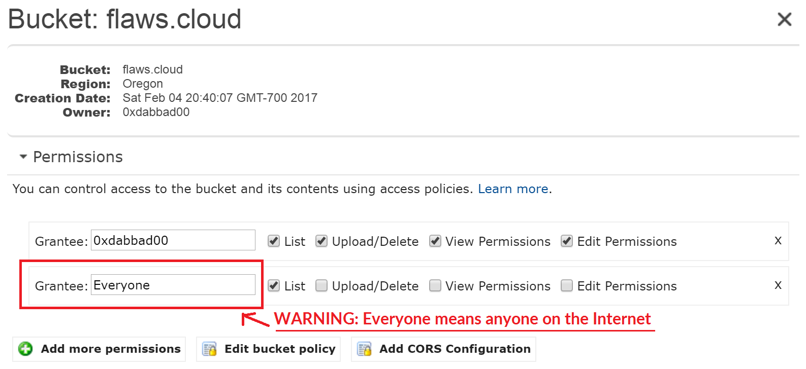

# flaws.cloud Level 2

**Platform:** http://flaws.cloud  
**Category:** S3 Misconfiguration - Authenticated Access

## Vulnerability
S3 bucket was accessible to any authenticated AWS user,
not just the bucket owner.


> WARNING: "Everyone" means anyone on the Internet

## Steps
1. Accessed bucket using personal AWS credentials via CLI

\```bash
aws s3 ls s3://level2-c8b217a33fcf1f839f6f1f73a00a9ae7.flaws.cloud
\```

2. Found hidden file `secret-e4443fc.html` and accessed it directly

## Key Takeaway
Setting S3 permissions to "Any AWS authenticated user" is nearly as dangerous
as making it fully public. Any of the millions of AWS accounts can access it.

## How to Fix
- Never grant access to "Any AWS authenticated user"
- Use explicit IAM policies to allow only specific accounts or roles
- Regularly audit S3 bucket policies using AWS Access Analyzer