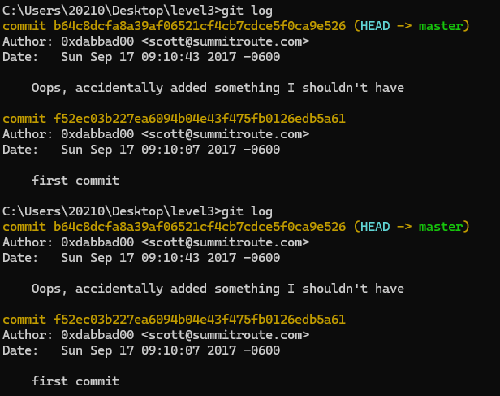
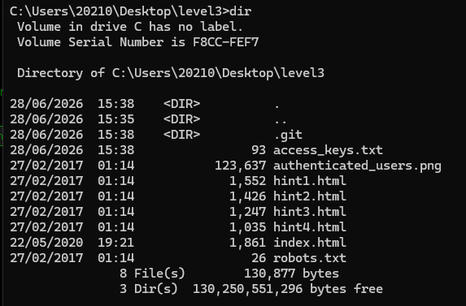
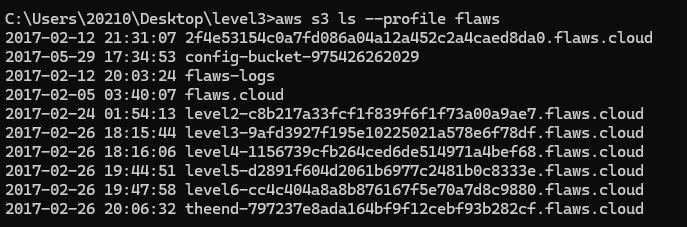

# flaws.cloud Level 3

**Platform:** http://flaws.cloud  
**Category:** Exposed Git History / AWS Key Leak

## Vulnerability
A `.git` directory was publicly accessible in the S3 bucket.
A previous commit contained AWS access keys that were later deleted,
but remained in git history.

## Steps
1. Listed bucket contents and found `.git/` directory

\```bash
aws s3 ls s3://level3-9afd3927f195e10225021a578e6f78df.flaws.cloud
\```

2. Downloaded entire bucket contents locally

\```bash
aws s3 sync s3://level3-9afd3927f195e10225021a578e6f78df.flaws.cloud/ level3 --no-sign-request
\```

3. Checked git log and found suspicious commit message

\```bash
git log
\```



4. Checked out the previous commit

\```bash
git checkout f52ec03b227ea6094b04e43f475fb0126edb5a61
\```

5. Found `access_keys.txt` containing AWS credentials



6. Used the keys to list all S3 buckets in the account

\```bash
aws configure --profile flaws
aws s3 ls --profile flaws
\```



7. All level buckets exposed including the final level

## Key Takeaway
Deleting sensitive data in a new commit does NOT remove it from git history.
Once a secret is committed, it must be treated as compromised immediately.

## Real-world Example
- Thousands of AWS keys are leaked on GitHub every day
- Bots scan GitHub 24/7 for exposed credentials
- Exposed keys can be exploited within minutes of being pushed

## How to Fix
- Never commit secrets or credentials to git
- Use `.gitignore` to exclude sensitive files
- Use AWS Secrets Manager or environment variables instead
- If a key is accidentally committed, delete it immediately AND rotate the key
- Use tools like `git-secrets` or `truffleHog` to scan for leaked credentials