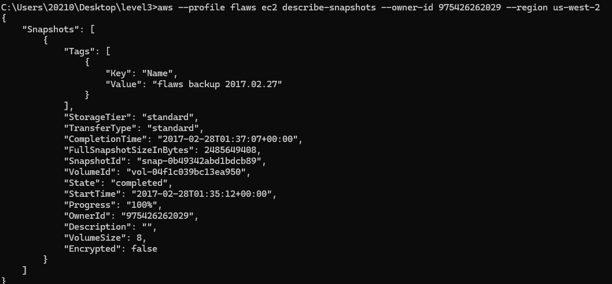
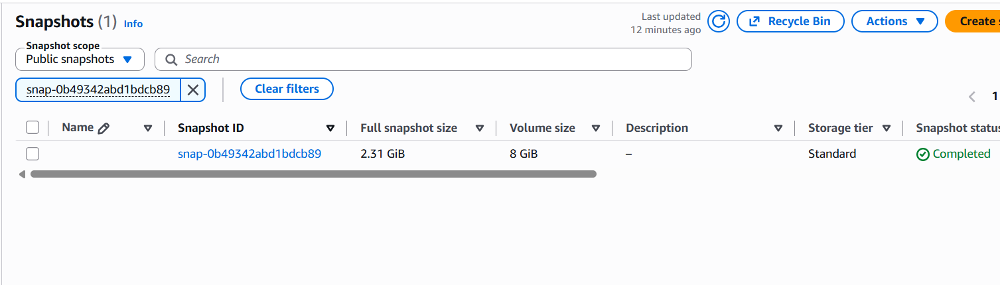
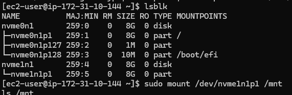
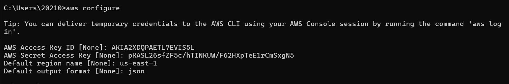
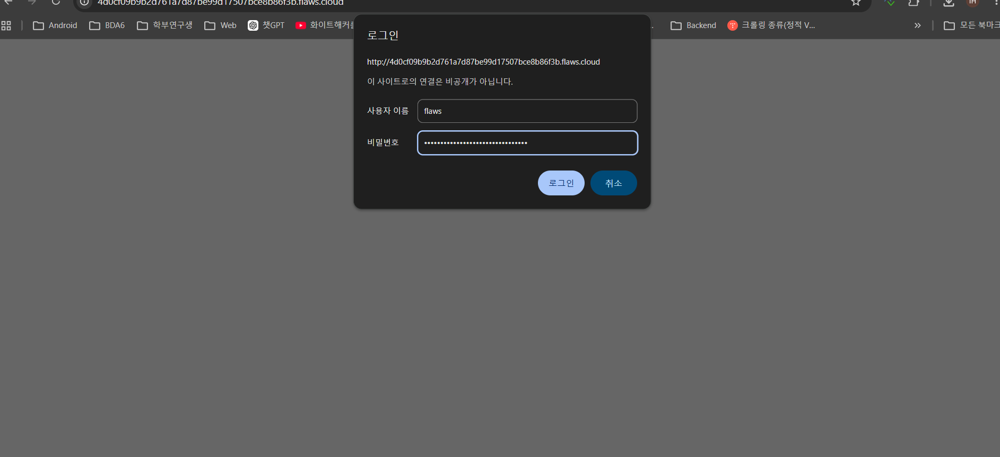

# flaws.cloud Level 4

**Platform:** http://flaws.cloud  
**Category:** Exposed EC2 Snapshot

## Vulnerability
An EC2 volume snapshot was made public, allowing anyone to mount
the disk and read sensitive files including credentials.

## Steps
1. Used flaws AWS key from Level 3 to get account ID

\```bash
aws --profile flaws sts get-caller-identity
\```

2. Found public snapshot using owner account ID

\```bash
aws --profile flaws ec2 describe-snapshots --owner-id 975426262029 --region us-west-2
\```



3. Created a volume from the snapshot in AWS console (us-west-2c)



4. Launched a new EC2 instance (Amazon Linux 2023, t3.micro)
5. Attached the snapshot volume to the EC2 instance
6. SSH'd into the EC2 instance

\```bash
ssh -i "flaws-key.pem" ec2-user@18.237.168.135
\```

7. Identified attached volumes and mounted the snapshot volume

\```bash
lsblk
sudo mount /dev/nvme1n1p1 /mnt
\```



8. Found credentials in plain text script

\```bash
cat /mnt/home/ubuntu/setupNginx.sh
\```



9. Used credentials to log into Level 4 site



## Key Takeaway
EC2 snapshots contain the entire disk contents including credentials and config files.
Making snapshots public is as dangerous as exposing the server itself.

## How to Fix
- Never make EC2 snapshots public
- Regularly audit snapshot permissions using AWS Config
- Never store credentials in plain text scripts
- Use AWS Secrets Manager for credential management
- Encrypt EBS volumes so snapshots are also encrypted